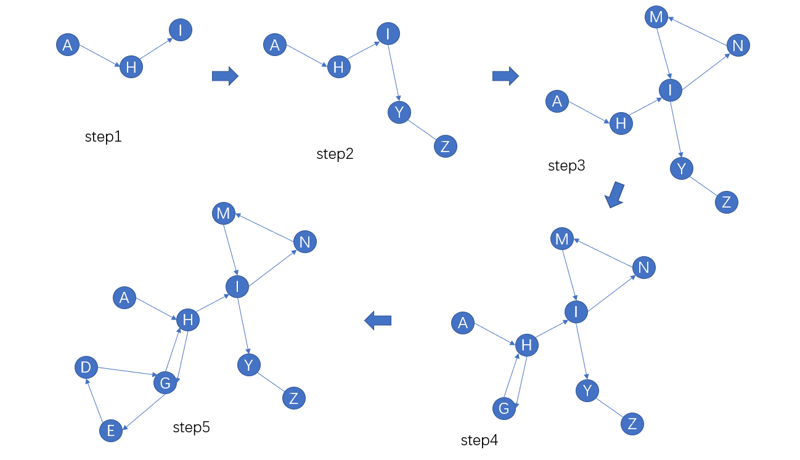

# 数据结构图小结

> 这篇小结中的所有题目均来自洛谷的"图的基本应用"题单。其中主要涉及到的相关知识有：dfs 和 bfs 的基本应用，根据 dfs 求有向无环图中最大路径、路径数量，根据拓扑排序判断图中是否有环的存在以及能否形成稳定的有序序列，找出图中的欧拉通路。

[TOC]

## P5318_查找文献（dfs和bfs基本应用）

* [题目连接](https://www.luogu.com.cn/problem/P5318)
* 题目描述：给定一个有向图，输出深搜和广搜的结果，但是必须保证输出结果的字典序尽可能的小
* 解题思路：
  该题的难点在保证输出字典序尽可能小，因此需要对每一个点的邻接点按照序号进行排序，随后 dfs、bfs 即可
* 核心代码

    ```c++
    // q 是用于存储邻接表的 vector 数组
    for(int i = 0; i < m; ++i){
        scanf("%d %d", &a, &b);
        q[a].push_back(b);
    }
    for(int i = 1; i <= n; ++i){
        sort(q[i].begin(), q[i].end());
    }
    // 随后根据排序后的邻接表深搜和广搜即可
    dfs();
    bfs();
    ```

## P3916_图的遍历（dfs查找到达的最大顶点）

* [题目链接](https://www.luogu.com.cn/problem/P3916)
* 题目描述：给定一个有向图，有 n 个点， m 条边，其中点从 1 到 n 进行编号。确定每个点所能到达的最大点的编号
* 解题思路：
  这道题本质是一个深度优先搜索，对每一个点进行搜索即可。但是关键的一点是从第 n 个点开始搜索，第 n 个点所到达的点的最大值必然是 n，同时将其进行标记；随后从第 n-1 个点开始搜索，对于所有未被访问过的点来说，如果其能被第 n-1 个点到达，那么其可到达的最大值必然是 n-1，以此类推，直到第 1 个点为止。
* 核心代码
  
    ```c++
    void dfs(int p, int v){
        a[p] = v;   // 记录点 p 可以到达的编号最大的点
        vis[p] = true;
        for(int k = head[p]; k; k = edges[k].next){ // 继续寻找点 v 可以到达的点
            if(!vis[edges[k].to])
                dfs(edges[k].to, v);
        }
    }

    // 从第 n 个点开始倒序搜索
    for(int i = n; i >= 1; --i){
        if(!vis[i]) dfs(i, i);  // 若点 i 已经被访问，则点 i 可以到达的顶点也一定已经被访问了
                                // 此时无需 dfs
    }
    // 输出结果
    for(int i = 1; i <= n; ++i){
        printf("%d ", a[i]);
    }
    ```

## P1113_杂务（dfs查找固定终点的最长路径）

* [题目链接](https://www.luogu.com.cn/problem/P1113)
* 题目描述：John 在给奶牛挤奶前需要完成许多杂务，只有一些杂务已经被完成之后某些杂物才能开始去做。例如，如果想要完成杂务`D`，而杂务`D`需要在`A`、`B`都已经完成的情况下才能开始做。完成每个杂务都需要一定的时间，而农场中有足够的工人去同时去做没有依赖关系的杂务，求完成所有杂务所需的最短时间。
* 解题思路：
  使用深搜的思想来解决拓扑排序的问题。假设杂务`D`需要`A`、`B`都完成后才能开始，设 `t[D]` 为完成杂务D所需的最短时间，则 `t[D] = min(t[A], t[B])`，而完成A，B所需的最短时间以此类推，直到没有前一项杂务为止。
* 核心代码

    ```c++
    vector<int> v[maxn];
    int dfs(int p){
        int len = v[p].size();
        int mx = 0;
        for(int i = 0; i < len; ++i){
            // 使用记忆化搜索可以极大的减少时间
            if(!vis[v[p][i]]) mx = max(dfs(v[p][i]), mx);
            else mx = max(vis[v[p][i]], mx);
        }
        vis[p] = mx + t[p]; // 记录完成杂务 p 所需时间
        return vis[p];
    }
    ```

* 相似题型：[P4017最大食物链计数](https://www.luogu.com.cn/problem/P4017)该题求一个有向无环图中从头至尾链的数目，用的同样是 dfs 的思想来解决拓扑排序的问题。

## P1807_最长路（dfs查找固定起点和终点的最长路径）

* [题目链接](https://www.luogu.com.cn/problem/P1807)
* 题目描述：给定一个有向无环图，有 n 个顶点 m 条边，顶点从 1 至 n 进行编号，边有权值，可以为负权。求出从点 1 到点 n 的最大路径，若不连通则输出-1。
* 解题思路：同样的深搜。其与上一题的区别在于对递归边界返回值的处理。
* 核心代码
  
    ```c++
    // 返回点 p 到达 1 的最长距离
    int dfs(int p){
        if(p == 1) return 0;
        int mx = -INF, v;
        vis[p] = true;
        for(int k = head[p]; k; k = edges[k].nxt){
            v = edges[k].v;
            if(!vis[v]) dfs(v); // 递归的求解点 p 到点 1 的最长距离
            // 如果联通，则找到最大的子路径
            if(len[v] != INF) mx = max(mx, len[v] + edges[k].w);
        }
        if(mx == -INF) mx = INF;
        return len[p] = mx;
    }
    // 随后从点 n 开始 dfs 即可
    ```

## P1127_词链（求欧拉通路）

* [题目链接](https://www.luogu.com.cn/problem/P1127)
* 题目描述：如果单词 x 的尾字母和单词 y 的首字母相同，则单词 x 可以和单词 y 首尾相连成词链 x.y。现给定一些单词，找出字典序最小的词链，并且所有单词在该词链中出现并且只出现一次。
* 基础知识：该题是一道求**欧拉通路**的题。由于我离散数学学的不是很好，因此还不得不百度了一下如何求欧拉通路QAQ。因此需要明确一些欧拉通路的概念。
    * **欧拉通路**：通过图中的每条边且仅通过一次，并且通过每一个顶点的路径
    * **欧拉回路**：通过图中的每条边且仅通过一次，并且通过每一个顶点的回路
    * **判断欧拉通路是否存在**：对于无向图，该图必须联通，有且仅有两个顶点的度数为奇数，其余顶点的度数为偶数，且该两个顶点为欧拉通路的两端；对于有向图，该有向图的基图需联通（将所有有向边变为无向边），有且仅有两个顶点的出度和入度不相等，且一个顶点的出度比入读大 1（通路起点），一个顶点的入读比出度大 1（通路终点），其他所有顶点出度和入度相同。
    * **判断欧拉回路是否存在**：对于无向图，其所有顶点的度数都为偶数；对于有向图，其所有顶点的出度和入读相同。
    
    * **求解欧拉通路/回路的步骤**：
        * 注：此处仅以**有向图的欧拉通路**为例，并且假设通路起点入读为 0，出度为 1，终点出度为 0，入读为 1。在我们的遍历过程中，我们每从一个顶点出发，该顶点的出度 -1，每进入一个顶点，该顶点的入读 -1。
        * **step1**：首先我们可以轻易的**确定欧拉通路的开始顶点**，如上图所示，开始顶点为 `A`，随后我们以 `A` 为起点开始dfs。如 `step1`，假设我们访问到了顶点 `H`，若 `H` 非回路终点，那么由于**出度与入读相同**，则其必有一条边可以使我们继续向下访问，接下来我们访问到点 `I`，若 `I` 同样不是通路终点，则我们同样一定可以继续走下去。
        * **step2**：我们将如同step1中所示持续向下访问，直到我们到达**通路终点** `Z`，由于其出度为 0，我们无法继续向下访问，此时我们可以得到一条路径`"A->H->I->Y->Z"`，通常情况下此条路径无法遍历有向图中所有的顶点，因此我们需要继续拓展到其他的点。
        * **step3**：我们访问完 `Z` 之后，开始**回退**，回到上一次的顶点 `Y`，若 `Y` 的边已经被遍历完毕，则我们继续回退，回到顶点 `I`，此时我们发现 `I` 有其他的边，这是我们开始以 `I` 为起点进行 dfs，当从 `I` 出发时，此时 `I` 的入读比出度大 1。同样的，由于从 `I` 点开始 dfs 所访问到的顶点的出度与入读相同，因此 dfs 最终将只能在入读比出度小 1 的顶点（即点 `I`）终止。我们可得到一条回路 `"I->N->M->I"`
        * **step4**：深搜完点 `I` 之后，我们将回退点 `N、M`，若 `N、M` 没有多余边，则继续回退，此时回退到点 `H`，依照步骤4，我们访问到了 `G` 点并回到 `H`
        * **step5**：在 `step4` 中，当我们回到 `G` 后，需要对从 `G` 点出发深搜到的点进行回退，假设我们回退到点 `G`，发现点 `G` 仍有其他边，则从 `G` 出发开始深搜，搜到了 `D` 和 `E`，随后结束搜索。若此时图中的所有边都已经被遍历，则我们将持续回退，直到回退到点 `A`，结束欧拉通路的查找。
        * 如果我们在某一节点回退结束时输出当前节点，则最后我们可以得到序列 `"Z Y I M N I H G D E G H A"`
    * 具体查找欧拉通路的代码
  
    ```c++
    // 使用邻接矩阵进行dfs得到欧拉回路，实际操作中建议使用前向星或邻接表
    // 此处给出无向图查找欧拉通路，有向图可以自己写写试试看
    int graph[maxn][maxn];
    int path[maxn], cnt = 0, vis[maxn];
    int n, m;
    void dfs(int p){
        for(int i = 1; i <= n; ++i){    // 遍历顶点 p 的所有邻接点
            if(graph[p][i]){
                --graph[p][i];  // 减去顶点的度数
                --graph[i][p];
                dfs(i);
            }
        }
        path[cnt++] = p;    // 遍历完点 p 的所有邻接边之后存储点 p
    }
    int main(){
        int u, v;
        cin>>n>>m;
        for(int i = 0; i < m; ++i){
            scanf("%d %d", &u, &v);
            ++graph[u][v];
            ++graph[v][u];
        }
        dfs(1);
        // 最终输出结果为倒序
        for(int i = 0; i < cnt; ++i){
            cout<<path[i]<<" ";
        }
        cout<<endl;
        system("pause");
        return 0;
    }
    ```

* 核心代码：
  
    ```c++
    void dfs(int u){
        for(int p = head[u]; p; p = edges[p].nxt){
            if(!edges[p].vis){
                edges[p].vis = 1;
                dfs(edges[p].v);
                path.push(edges[p].word);
            }
        }
    }
    int main(){
        input();    // 读入单词，并进行建图，由于要求字典序最小，因此需要进行排序，参考上文 图的遍历 一题
        int flag = -1;
        // 找到起点 flag
        for(int i = 0; i < maxgroup; ++i){
            // degree[i][0] 表示出读，degree[i][1] 表示入度
            if(degree[i][0] == degree[i][1]+1){
                flag = i;
                break;
            }
        }
        if(flag == -1){
            // 如果找不到起点，说明此时存在欧拉回路，只需找到字典序最小的单词即可
            for(int i = 0; i < maxgroup; ++i){
                if(words[i].size()){
                    dfs(i);
                    break;
                }
            }
        }
        else dfs(flag); // 从起点开始 dfs
        output();
        system("pause");
        return 0;
    }
    ```

## P1363_幻象迷宫（dfs思维题）

* [题目链接](https://www.luogu.com.cn/problem/P1363)
* 题目描述：给定一个n*m的矩阵迷宫，其中“#”表示墙，“.”表示道路，将该迷宫上下左右进行平移，可以平铺成一个无限大的迷宫。给定起点，问能否从起点出发到达无限远的位置。
* 解题思路：进行dfs搜索，记录走到的位置的**绝对位置**（lx, ly)（绝对位置是指其在无限大迷宫中相对起点的横纵坐标，也就是说lx,ly不对边长进行取模运算），同时该所走到的位置还有一个**朴素位置**（x，y）（朴素位置是指其在原始迷宫中相对起点的位置，x,y需进行取模运算）。当走到某个位置时，若之前已经走到过该位置，且两次的绝对位置不同，则可以在迷宫中可以走到无限远的地方。
* 核心代码：
  
    ```c++
    // x，y表示朴素位置，lx，ly表示绝对位置
    // g[x][y][0] 记录该点是否已访问以及能否访问，-1 表示该点为墙，0 表示未访问，1 表示已被访问过
    // g[x][y][1] 和 g[x][y][2] 分别记录绝对位置的横纵坐标
    bool dfs(int x, int y, int lx, int ly){
        bool flag = false;
        if(g[x][y][0]==1 && (g[x][y][1]!=lx || g[x][y][2]!=ly)){
            // 当前位置之前已经访问过，且两者的绝对位置不同
            flag = true;
        }else if(g[x][y][0]==0){
            // 进行标记记录绝对位置
            g[x][y][0] = 1;
            g[x][y][1] = lx;
            g[x][y][2] = ly;
            for(int i = 0; i < 4; ++i){
                int xx = (x + d[i].x + n)%n;
                int yy = (y + d[i].y + m)%m;
                flag = dfs(xx, yy, lx+d[i].x, ly+d[i].y);
                if(flag) break;
            }
        }
        return flag;
    }
    ```

## P1347_排序（拓扑排序确定有序序列）

* [题目链接](https://www.luogu.com.cn/problem/P1347)
* 题目描述：有一串字母，两两之间满足大小关系，现给定 n 个字母，m 条关系，每条关系以 "A < B" 的形式依次给出，若根据前 x 条关系可以确定这 n 个字母唯一的顺序关系，则输出结果，若根据前 x 条关系发现这 n 个字母之间无法形成顺序关系，同样输出结果，若直到最后也无法确定其是否能够组成固定的顺序关系，则输出另一结果。
* 解题思路：这道题是一道典型的拓扑排序题目，每读入一个关系，就根据当前所建图执行一遍拓扑排序，其有三种结果：发现当前图成环、发现可以确定唯一的顺序关系、发现无法确定唯一的顺序关系。前两种结果直接输出，停止程序，而若是第三种结果则继续读入，重复拓扑排序的步骤。
* 核心代码：

    ```c++
    int topo(){
        queue<int> q;
        int flag = 0, degree[maxn], cnt = 0;
        // 复制一遍顶点入度
        for(int i = 0; i < n; ++i){
            degree[i] = indegree[i];
        }
        // 将所有入度为 0 的点加入队列
        for(int i = 0; i < n; ++i){
            if(!degree[i]){
                q.push(i);
            }
        }
        // 开始拓扑排序
        int p;
        while(!q.empty()){
            // 当队列中存在不止一个元素时，说明此时存在不稳定的队列或者当前的边未包括全部的顶点
            if(q.size() > 1) flag = 1;
            p = q.front(); q.pop();
            ans[cnt++] = p; // 记录当前确定的顺序，该顺序可能唯一，也可能不唯一
            for(int k = head[p]; k; k = edges[k].nxt){
                int pp = edges[k].to;
                --degree[pp];
                if(!degree[pp]) q.push(pp);
            }
        }
        // 通过检查是否有入度不为0来确定是否存在环
        int status = 0;     // 默认既没有环，也没有稳定序列
        for(int i = 0; i < n; ++i){
            if(degree[i]){
                status = 1; // 标记存在环
                break;
            }
        }

        if(!flag && !status && cnt == n) status = 2;   // 此时存在稳定序列
        return status;
    }
    ```

## P1983_车站分级（有向无环图不固定起点和终点最长路径）

* [题目链接](https://www.luogu.com.cn/problem/P1983)
* 题目描述：有编号从 1 到 n 的火车站，不同的站点有不同的登记。火车会在其经过的某些火车站停下，如果火车站在序列为{$a_1,a_2,a_3,...,a_k$}的车站中停下，则从首发站 $a_1$ 到终点站 $a_k$ 中的所有**没有停下的车站**的级别都低于停下的车站{$a_1,a_2,a_3,...,a_k$}。现给出 m 个火车的航站表（每个表中包含了第 i 趟火车所有停下的车站），试确定所划分级别的最小数目。
* 解题思路：首先根据航站表建图，根据已确定的等级关系所建的图找出图中最长路径即可。详情见题目[杂务](P1113_杂务（dfs查找固定终点的最长路径）)。本题的一个小难点在于如何根据航展表建图，建图部分代码如下：

    ```c++
    // bool vis[maxn] 记录停下的站点
    // bool g[maxn][maxn] 记录已经加的边
    void input(){
        n = read(); m = read();
        int port[maxn]; // 记录停下的站点
        for(int i = 0; i < m; ++i){
            int k, l, r;
            k = read();
            memset(vis, 0, sizeof(vis));
            for(int j = 0; j < k; ++j){
                port[j] = read();   // 以两种方式存储停下的站点
                vis[port[j]] = 1;
            }
            l = port[0]; r = port[k-1]; // 得到始发站和终点站
            for(int p = l; p < r; ++p){ // 遍历是发展到终点站之间的所有站点
                if(!vis[p]){    // 如果该站点未被停下，则为该站点和停下的站点建边
                    for(int j = 0; j < k; ++j){
                        if(!g[port[j]][p]){ // 若该边已经加过，则不再添加
                            edges[port[j]].push_back(p);
                            g[port[j]][p] = true;
                        }
                    }
                }
            }
        }
    }
    ```
